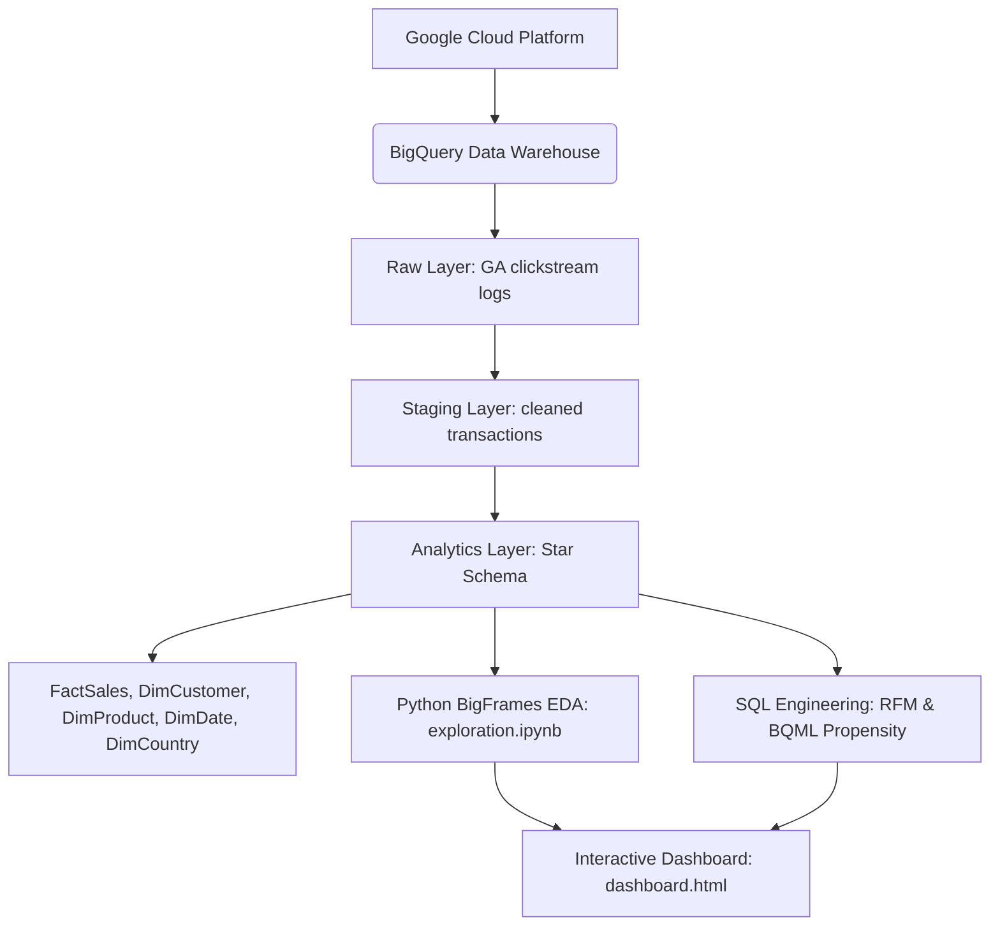

# Google Merchandise Store: End-to-End E-Commerce Data Warehouse & Analytics Pipeline
**An Advanced Portfolio-Level Business & Data Analytics Project**

This project demonstrates a comprehensive, end-to-end analytics workflow using **Google Cloud Platform (BigQuery)**, **Python (BigFrames & Pandas)**, **SQL Analytics Engineering**, and interactive data visualization. 

We analyze a massive Google Analytics dataset containing **21,493,109 user session records** from the Google Merchandise Store to discover funnel leakage, geographical friction anomalies, channel efficiencies, and predict customer purchase propensity.

---

## 🚀 Architecture Overview & Data Warehouse Layers



The data warehouse is structured into three clear architectural layers:
1. **Raw Layer**: Direct clickstream logs from the store (`data-to-insights.ecommerce.all_sessions`).
2. **Staging Layer**: Sanitized, typed, and deduplicated transaction and session logs.
3. **Analytics Layer (Star Schema)**: A dimensional model structured to optimize query speed and eliminate redundancy:
   * **`FactSales`**: Relates price points, quantities, tax, shipping, and total revenue.
   * **`DimCustomer`**: Normalizes visitor profiles and primary traffic sources.
   * **`DimProduct`**: Splits category and subcategory hierarchies.
   * **`DimCountry`**: Normalizes geographic coordinates and regional parameters.
   * **`DimDate`**: Structures year, month, day, and day-of-week keys.
4. **Exploratory Data Analysis**: Jupyter Notebook [exploration.ipynb](exploration.ipynb) leveraging GCP **BigFrames** for in-database Python execution.
5. **Business Intelligence Visualization**: A premium, self-contained interactive dashboard [dashboard.html](dashboard.html) mirroring the layout of a 5-page Power BI dashboard (featuring a newly added Executive & ML propensity page). *(Note: The direct Power BI `.pbix` file is currently under final deployment and will be pushed here shortly. Until then, use the HTML dashboard to preview the exact design and functionality).*

---

## 📁 Repository Structure

```
├── sql/
│   ├── star_schema_definition.sql      # Data Warehouse layers (Raw, Staging, Star Schema Fact/Dims)
│   ├── customer_segmentation_rfm.sql   # RFM loyalty scoring & LTV tier customer segment models
│   ├── funnel_analysis.sql             # Channel conversion & matrix funnel queries
│   ├── country_friction_analysis.sql   # Regional conversion rates & fee friction (shipping/tax)
│   ├── category_hierarchy_analysis.sql # Hierarchical category splits & decomposition tree queries
│   ├── product_performance_analysis.sql# Individual product price, order session, & unit sales metrics
│   ├── page_exit_analysis.sql          # Exits share & URL dropping point analysis
│   └── bqml_propensity_model.sql       # Logistic regression model training, eval & predictions
├── exploration.ipynb                   # Advanced BigFrames notebook for python EDA
├── dashboard.html                      # Interactive light-theme dashboard (Leaflet + Chart.js)
├── README.md                           # Project documentation & business insights
└── valid-keep-465517-q8-xxx.json       # BQ Service account key (secured)
```

---

## 📊 Core Business & Analytical Insights

### 1. The Marketing Channel Efficiency Matrix
* **Referrals Drive the Volume**: Referral channels account for **>50% of total store checkouts** (12,150 orders) and convert at an extremely high session conversion rate (**12.19%**).
* **Organic Search Traffic Bloat**: While Organic Search represents the largest traffic driver (**48.67% share of sessions**), it yields a lower conversion rate (**1.58% CVR**), pointing to high top-of-funnel browsing but weak purchasing intent.
* **Paid/Social Spends Lag**: Paid Search (3.62% CVR) and Social (0.42% CVR) capture approximately **3%** of combined orders. Recommend evaluating budget allocations on social media advertising.

### 2. Funnel Friction & Dropoff (The "India Leakage")
* **The Anomaly**: Visitors from India represent the **2nd largest regional traffic segment** (25,367 sessions) but result in only **22 completed orders** (an extremely low **0.09% CVR**). By contrast, United States traffic converts at **7.46%**.
* **Leakage Mapping**:
  * **India Funnel**: Session Start (25.3K) ➔ Product View (5,130) = **79.78% dropoff** ➔ Add to Cart (2,169) ➔ Completed Order (22) = **98.99% dropoff**.
  * **US Funnel**: Session Start (306K) ➔ Product View (115.9K) = **62.18% dropoff** ➔ Add to Cart (57.8K) ➔ Completed Order (22.8K) = **60.45% dropoff**.
* **Recommendation**: Indian users are highly motivated to click and add items to the cart, but drop off completely during final payment. This highlights local payment processing bottlenecks, lack of localized payment choices (e.g. UPI), or tax calculation hurdles at checkout.

### 3. Geographical Fee Friction Barriers
* **High Logistics Friction**: In regions like **Venezuela** (fee share **59.46%** of total order cost) and **Indonesia** (fee share **25.26%**), shipping and tax charges account for a massive chunk of cart totals. High fee friction correlates directly with depressed conversion rates in these territories.

### 4. Category Decomposition
* **Nest-USA Dominance**: Revenue is highly concentrated. Nest-USA products generate **$2.58M** (**36.14%** of catalog revenue), followed by Apparel (**$974K / 13.63%**) and Office Accessories (**$784K / 10.97%**).

---

## 🔮 Predictive Modeling: BigQuery ML

We implemented a Logistic Regression classifier inside BigQuery to predict whether a visitor session will result in a purchase (`label` = 1 or 0). 

### BQML Propensity Query:
```sql
CREATE OR REPLACE MODEL `ecommerce.purchase_propensity_model`
OPTIONS(model_type='logistic_reg', input_label_cols=['label']) AS
SELECT
  IF(transactionId IS NOT NULL, 1, 0) AS label,
  channelGrouping,
  country,
  IFNULL(pageviews, 0) AS pageviews,
  IFNULL(timeOnSite, 0) AS timeOnSite,
  IFNULL(sessionQualityDim, 0) AS session_quality_score
FROM `data-to-insights.ecommerce.all_sessions`
WHERE pageviews IS NOT NULL;
```
This model allows the e-commerce store to flag high-propensity sessions in real-time, enabling personalized discount triggers or cart reminders to recover abandoned carts.

---

## 🎯 Strategic Business Recommendations

Based on the data warehouse findings, we propose five key business strategies to optimize conversion, reduce cart abandonment, and maximize profit margins:

### 1. Checkout Localization for High-Volume Leakage (India Market)
* **The Problem**: India represents your 2nd largest traffic channel (25.3K sessions) but suffers a catastrophic **98.99% dropoff** from Add-to-Cart to Completed Purchase.
* **The Action**: 
  * **Integrate Localized Gateways**: Deploy UPI (Unified Payments Interface), RuPay, and local net-banking options in the Indian region rather than relying solely on global credit card processors.
  * **Transparent Landed Costs**: Show localized duties, taxes, and shipping costs upfront on the product page rather than introducing them at the final checkout step.

### 2. Marketing Budget Redirection & Social Media Retargeting
* **The Problem**: Social channels drive significant traffic (7.87% share) but yield a very low **0.42% conversion rate**. Conversely, Referral has a **12.19% conversion rate**.
* **The Action**:
  * **Shift Spends**: Reallocate top-of-funnel social acquisition spends to Referral channels or Organic Search SEO.
  * **Retargeting Campaigns**: Transition social spend from broad branding to targeted, bottom-of-funnel retargeting ads focusing exclusively on "Cart Abandoners" identified by your BigQuery ML propensity model.

### 3. Tiered Shipping thresholds to Counter Fee Friction
* **The Problem**: High logistics costs (59.46% fee share in Venezuela, 25.26% in Indonesia) lead to severe checkout abandonment.
* **The Action**:
  * **Free Shipping Thresholds**: Implement a tiered threshold (e.g., *"Free shipping on international orders over $150"*). This absorbs shipping fees into product margins while raising Average Order Value (AOV).
  * **Regional Warehousing**: Partner with regional fulfillment centers in Southeast Asia and South America to reduce base international shipping rates.

### 4. Smart Cross-Selling Bundles (Nest-USA Anchoring)
* **The Problem**: Nest-USA products generate **36.14%** of store revenue. Apparel and Office generate high volume but lower order values.
* **The Action**:
  * **Anchor Bundling**: Create "Smart Home Starter Bundles" where Nest purchases automatically offer discounted co-branded apparel or desk accessories. This leverages your highest-revenue category to clear high-volume accessory inventory.

### 5. Real-Time Propensity-Based Promos (BQML Integration)
* **The Problem**: Customers showing high purchase intent (high page views/time on site) exit without purchasing.
* **The Action**:
  * **Triggered Promotions**: Integrate your BQML propensity model scores with your web front-end. When a user with a propensity score of **>75%** shows exit-intent signals (e.g. cursor moving toward the window close button), trigger a real-time modal offering free shipping or a 10% coupon to secure the transaction.

---

## 💻 How to View & Run the Project

### 🖥️ Power BI & Interactive Dashboard
> [!NOTE]
> **Power BI Dashboard Status**: 🛠️ Under Construction (Uploading shortly).
>
> In the meantime, you can open the interactive **[dashboard.html](dashboard.html)** in any web browser. It is a custom-built, premium replica that replicates the exact layouts, styling, metrics, and chart placements of the 4-page Power BI dashboard.

* **How to run HTML dashboard**: Simply double-click [dashboard.html](dashboard.html) to open in any browser (no local server or database setup required).
* **Interactions**: Toggle between tabs to inspect **Overview & Channel Funnels**, **Geographical Maps** (with Leaflet interactive popups), **Category Decomposition Trees** (with click-expandable nodes), and a searchable **Product Catalog**.

### 2. Running Python BigFrames Notebook
Ensure you have Python installed, then:
```bash
pip install bigframes openpyxl pandas notebook
jupyter notebook
```
Open [exploration.ipynb](exploration.ipynb) and run cells to authenticate your GCP project and execute cloud queries.

### 3. Executing SQL Scripts
The queries in [sql/](sql/) can be copied and run directly inside the **GCP BigQuery console** to regenerate outputs. Replace billing project `valid-keep-465517-q8` with your respective billing project if applicable.
