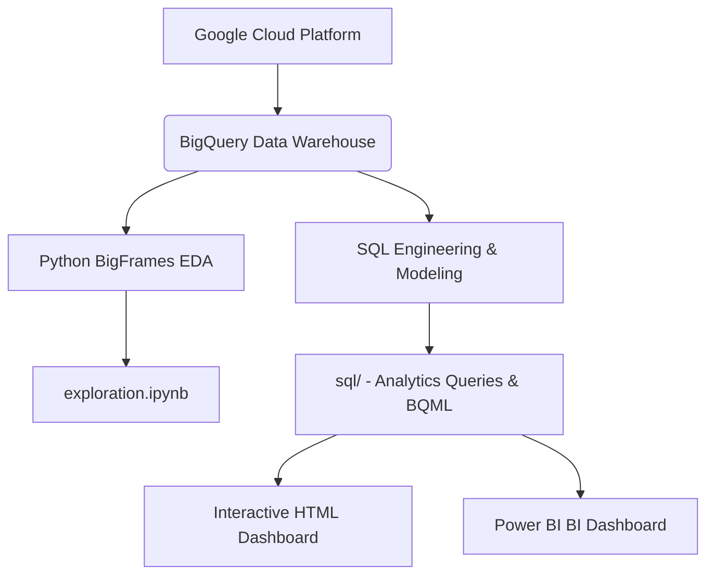

# Google Merchandise Store: End-to-End E-Commerce Data Warehouse & Analytics Pipeline
**An Advanced Portfolio-Level Business & Data Analytics Project**

This project demonstrates a comprehensive, end-to-end analytics workflow using **Google Cloud Platform (BigQuery)**, **Python (BigFrames & Pandas)**, **SQL Analytics Engineering**, and interactive data visualization. 

We analyze a massive Google Analytics dataset containing **21,493,109 user session records** from the Google Merchandise Store to discover funnel leakage, geographical friction anomalies, channel efficiencies, and predict customer purchase propensity.

---

## 🚀 Architecture Overview



1. **Data Ingestion & Warehousing**: Structured schema mapping in Google BigQuery (`data-to-insights.ecommerce.all_sessions`).
2. **Exploratory Data Analysis**: Jupyter Notebook [exploration.ipynb](exploration.ipynb) using GCP **BigFrames** to process data on cloud compute without RAM constraints.
3. **Analytics Engineering**: Production-ready SQL queries structured with Common Table Expressions (CTEs), window functions, and pivoting in the [sql/](sql/) directory.
4. **Predictive Modeling**: In-database logistic regression classifier utilizing **BigQuery ML (BQML)** to output customer propensity-to-buy scores.
5. **Business Intelligence Visualization**: A premium, self-contained interactive dashboard [dashboard.html](dashboard.html) mirroring the layout of a 4-page Power BI dashboard.

---

## 📁 Repository Structure

```
├── sql/
│   ├── funnel_analysis.sql             # Channel conversion & matrix funnel queries
│   ├── country_friction_analysis.sql   # Regional conversion rates & fee friction (shipping/tax)
│   ├── category_hierarchy_analysis.sql # Hierarchical category splits & decomposition tree queries
│   ├── product_performance_analysis.sql# Individual product price, order session, & unit sales metrics
│   ├── page_exit_analysis.sql          # Exits share & URL dropping point analysis
│   └── bqml_propensity_model.sql       # Logistic regression model training, eval & predictions
├── exploration.ipynb                   # Advanced BigFrames notebook for python EDA
├── dashboard.html                      # Interactive dark-theme dashboard (Leaflet + Chart.js)
├── README.md                           # Project documentation & business insights
└── valid-keep-465517-q8-xxx.json       # BQ Service account key (secured)
```

---

## 📊 Core Business & Analytical Insights

### 1. The Marketing Channel Efficiency Matrix
* **Referrals Drive the Volume**: Referral channels account for **>50% of total store checkouts** (12,150 orders) and convert at an extremely high session conversion rate (**12.19%**).
* **Organic Search Traffic Bloat**: While Organic Search represents the largest traffic driver (**48.67% share of sessions**), it yields a lower conversion rate (**1.58% CVR**), pointing to high top-of-funnel browsing but weak purchasing intent.
* **Paid/Social Spends Lag**: Paid Search (3.62% CVR) and Social (0.42% CVR) capture under 3% of combined orders. Recommend evaluating budget allocations on social media advertising.

### 2. Funnel Friction & Dropoff (The "India Leakage")
* **The Anomaly**: Visitors from India represent the **2nd largest regional traffic segment** (25,367 sessions) but result in only **22 completed orders** (an extremely low **0.09% CVR**). By contrast, United States traffic converts at **7.46%**.
* **Leakage Mapping**:
  * **India Funnel**: Session Start (25.3K) ➔ Product View (5,130) = **79.77% dropoff** ➔ Add to Cart (2,169) ➔ Completed Order (22) = **98.98% dropoff**.
  * **US Funnel**: Session Start (306K) ➔ Product View (115.9K) = **62.17% dropoff** ➔ Add to Cart (57.8K) ➔ Completed Order (22.8K) = **60.45% dropoff**.
* **Recommendation**: Indian users are highly motivated to click and add items to the cart, but drop off completely during final payment. This highlights local payment processing bottlenecks, lack of localized payment choices (e.g. UPI), or tax calculation hurdles at checkout.

### 3. Geographical Fee Friction Barriers
* **High Logistics Friction**: In regions like **Venezuela** (fee share **59.46%** of total order cost) and **Indonesia** (fee share **25.26%**), shipping and tax charges account for a massive chunk of cart totals. High fee friction correlates directly with depressed conversion rates in these territories.

### 4. Category Decomposition
* **Nest-USA Dominance**: Revenue is highly concentrated. Nest-USA products generate **$2.58M** (**36.14%** of catalog revenue), followed by Apparel (**$974K / 13.63%**) and Office Accessories (**$784K / 10.97%**).

---

## 🔮 Predictive Modeling: BigQuery ML

We implemented a Logistic Regression classifier inside BigQuery to predict whether a visitor session will result in a purchase (`label` = 1 or 0). 

### BQML Propensity Query:
```sql
CREATE OR REPLACE MODEL `ecommerce.purchase_propensity_model`
OPTIONS(model_type='logistic_reg', input_label_cols=['label']) AS
SELECT
  IF(transactionId IS NOT NULL, 1, 0) AS label,
  channelGrouping,
  country,
  IFNULL(pageviews, 0) AS pageviews,
  IFNULL(timeOnSite, 0) AS timeOnSite,
  IFNULL(sessionQualityDim, 0) AS session_quality_score
FROM `data-to-insights.ecommerce.all_sessions`
WHERE pageviews IS NOT NULL;
```
This model allows the e-commerce store to flag high-propensity sessions in real-time, enabling personalized discount triggers or cart reminders to recover abandoned carts.

---

## 💻 How to View & Run the Project

### 1. The Interactive Dashboard
Simply open [dashboard.html](dashboard.html) in any modern web browser.
* No local server setup or database connection is required.
* Toggle between tabs to inspect **Oveview & Channel Funnels**, **Geographical maps** (interactive popups via Leaflet), **Category Decomposition trees** (click-expandable nodes), and a searchable **Product Catalog**.

### 2. Running Python BigFrames Notebook
Ensure you have Python installed, then:
```bash
pip install bigframes openpyxl pandas notebook
jupyter notebook
```
Open [exploration.ipynb](exploration.ipynb) and run cells to authenticate your GCP project and execute cloud queries.

### 3. Executing SQL Scripts
The queries in [sql/](sql/) can be copied and run directly inside the **GCP BigQuery console** to regenerate outputs. Replace billing project `valid-keep-465517-q8` with your respective billing project if applicable.
