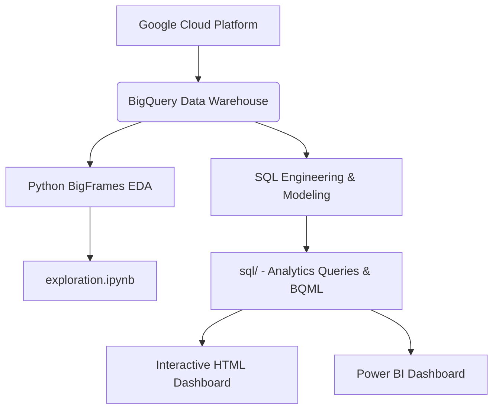

# Google Merchandise Store Analytics Pipeline

An end-to-end e-commerce data warehouse and predictive modeling project analyzing user sessions from the Google Merchandise Store.

This project implements a complete data pipeline using Google Cloud Platform (BigQuery), Python (BigFrames & Pandas), SQL Analytics Engineering, and interactive data visualization. The pipeline processes over 21 million user session records from the public Google Analytics dataset (`data-to-insights.ecommerce.all_sessions`) to identify funnel drop-offs, geographic pricing friction, marketing channel efficiency, and predict purchase propensity.

---

## Architecture Overview



1. **Data Ingestion & Warehousing**: Structured schema mapping in Google BigQuery.
2. **Exploratory Data Analysis**: Jupyter Notebook ([exploration.ipynb](exploration.ipynb)) using BigFrames to run pandas-like operations directly on BigQuery compute.
3. **Analytics Engineering**: Production SQL queries structured with CTEs, window functions, and pivoting (in the `sql/` directory).
4. **Predictive Modeling**: In-database logistic regression classifier built using BigQuery ML (BQML) to predict conversion propensity.
5. **Business Intelligence**: Interactive dashboard ([dashboard.html](dashboard.html)) mirroring the layout of the Power BI dashboard. *(Note: The Power BI `.pbix` file is under final staging and will be added here. Until then, use the HTML dashboard to preview layout and functionality).*

---

## Repository Structure

```
├── sql/
│   ├── funnel_analysis.sql             # Channel conversion & matrix funnel queries
│   ├── country_friction_analysis.sql   # Regional conversion rates & fee friction (shipping/tax)
│   ├── category_hierarchy_analysis.sql # Hierarchical category splits & decomposition tree queries
│   ├── product_performance_analysis.sql# Individual product price, order session, & unit sales metrics
│   ├── page_exit_analysis.sql          # Exits share & URL dropping point analysis
│   └── bqml_propensity_model.sql       # Logistic regression model training, eval & predictions
├── exploration.ipynb                   # BigFrames notebook for python EDA
├── dashboard.html                      # Interactive light-theme dashboard (Leaflet + Chart.js)
├── README.md                           # Project documentation & business insights
└── valid-keep-465517-q8-xxx.json       # BQ Service account key (secured)
```

---

## Key Analytical Insights

### 1. Marketing Channel Efficiency
* **Referrals Drive the Volume**: Referral channels account for over 50% of total checkouts (12,150 orders) and convert at a session conversion rate of 12.19%.
* **Organic Search Traffic Volume vs Conversion**: While Organic Search represents the largest traffic driver (48.67% share of sessions), it yields a lower conversion rate (1.58% CVR), pointing to high top-of-funnel browsing but lower immediate purchasing intent.
* **Paid/Social Spends**: Paid Search (3.62% CVR) and Social (0.42% CVR) capture under 3% of combined orders. This suggests a need to re-evaluate budget allocations on social media advertising.

### 2. Funnel Drop-off (India Checkout Leakage)
* **The Anomaly**: Visitors from India represent the 2nd largest regional traffic segment (25,367 sessions) but result in only 22 completed orders (0.09% CVR). For comparison, US traffic converts at 7.46%.
* **Leakage Mapping**:
  * **India Funnel**: Session Start (25.3K) ➔ Product View (5,130) = 79.77% drop-off ➔ Add to Cart (2,169) ➔ Completed Order (22) = 98.98% drop-off.
  * **US Funnel**: Session Start (306K) ➔ Product View (115.9K) = 62.17% drop-off ➔ Add to Cart (57.8K) ➔ Completed Order (22.8K) = 60.45% drop-off.
* **Recommendation**: Indian users are actively adding items to their carts but dropping off completely at checkout. This suggests payment gateway failures, a lack of localized payment choices (e.g. UPI), or international tax/shipping fee calculation hurdles.

### 3. Geographical Fee Friction Barriers
* **High Logistics Friction**: In regions like Venezuela (fee share 59.46% of total order cost) and Indonesia (fee share 25.26%), shipping and tax charges account for a large portion of cart totals. High fee friction correlates directly with depressed conversion rates in these territories.

### 4. Category Decomposition
* **Nest-USA Dominance**: Revenue is highly concentrated. Nest-USA products generate $2.58M (36.14% of catalog revenue), followed by Apparel ($974K / 13.63%) and Office Accessories ($784K / 10.97%).

---

## Predictive Modeling: BigQuery ML

We implemented a Logistic Regression classifier inside BigQuery to predict whether a visitor session will result in a purchase (`label` = 1 or 0). 

### BQML Propensity Query:
```sql
CREATE OR REPLACE MODEL `ecommerce.purchase_propensity_model`
OPTIONS(model_type='logistic_reg', input_label_cols=['label']) AS
SELECT
  IF(transactionId IS NOT NULL, 1, 0) AS label,
  channelGrouping,
  country,
  IFNULL(pageviews, 0) AS pageviews,
  IFNULL(timeOnSite, 0) AS timeOnSite,
  IFNULL(sessionQualityDim, 0) AS session_quality_score
FROM `data-to-insights.ecommerce.all_sessions`
WHERE pageviews IS NOT NULL;
```
This model allows the e-commerce store to flag high-propensity sessions in real-time, enabling personalized discount triggers or cart reminders to recover abandoned carts.

---

## How to View & Run the Project

### Power BI & Interactive Dashboard
> [!NOTE]
> **Power BI Dashboard Status**: Under Construction (Uploading July 18).
>
> In the meantime, you can open the interactive **[dashboard.html](dashboard.html)** in any web browser. It replicates the layouts, styling, metrics, and chart placements of the 4-page Power BI dashboard.

* **How to run HTML dashboard**: Simply double-click `dashboard.html` to open in any browser (no local server or database setup required).
* **Interactions**: Toggle between tabs to inspect Overview & Channel Funnels, Geographical Maps (with Leaflet interactive popups), Category Decomposition Trees (with click-expandable nodes), and a searchable Product Catalog.

### Running Python BigFrames Notebook
Ensure you have Python installed, then:
```bash
pip install bigframes openpyxl pandas notebook
jupyter notebook
```
Open `exploration.ipynb` and run cells to authenticate your GCP project and execute queries.

### Executing SQL Scripts
The queries in `sql/` can be copied and run directly inside the GCP BigQuery console. Replace billing project `valid-keep-465517-q8` with your respective billing project if applicable.
