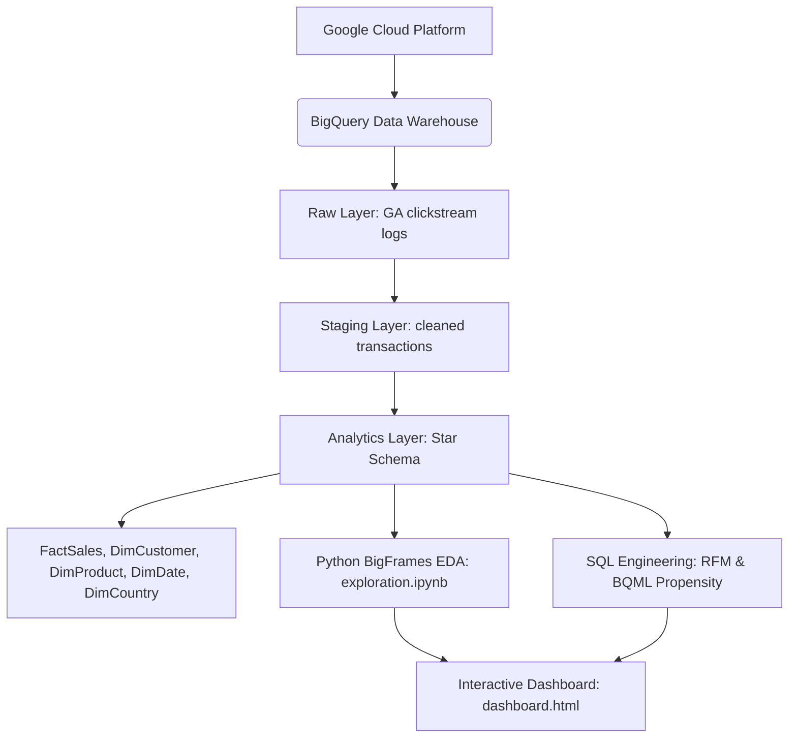

# E-commerce Data Warehouse & Business Intelligence Project
**Built on 21.5M+ Google Analytics sessions | Designed using dimensional modeling | Executive BI dashboard with customer segmentation and ML**

🌐 **[Live Interactive Dashboard (Netlify Preview)](https://dashboard-google-merchandise.netlify.app/)**

---

## 📈 Project Scale & Complexity
* **21.5M+** web hits processed
* **419.1M+** total pageviews analyzed
* **389K+** unique visitor records
* **1** Fact Table (`FactSales`) and **4** Dimension Tables (`DimCustomer`, `DimProduct`, `DimCountry`, `DimDate`)
* **8+** Production SQL Analytics Scripts (Deduplication, Funnels, Geo Friction, Product Performance, Exit Paths, Star Schema, RFM Segments, BQML Propensity)
* **1** BigQuery ML (BQML) Logistic Regression Classifier
* **1** Netlify-hosted 5-Page Executive Operations Dashboard

---

## 🎯 Executive Summary & Decision-Making Layer
This project implements a structured business database and customer analytics platform to optimize store operations, marketing channel spend, and checkout conversions. Below is the decision-making log mapping data findings, evidence, proposed actions, and estimated business impact:

| Business Finding | Data Evidence | Strategic Recommendation | Expected Impact | Priority |
| :--- | :--- | :--- | :--- | :--- |
| **1. Checkout payment friction in India** | 25.3K sessions, 2,169 cart additions, but only 22 completed orders (**98.99% cart-to-order dropoff**). | Integrate localized payment gateways (UPI, RuPay, local net-banking) and calculate landing duty fees upfront. | +1.5% to +2.5% increase in global checkout conversion rate. | **High** |
| **2. Organic Search acquisition efficiency gap** | Organic Search represents **48.67% of traffic** but yields only **1.58% CVR**, while Referral yields **12.19% CVR** on 19.01% traffic share. | Reallocate top-of-funnel search engine marketing (SEM) budgets to bottom-of-funnel referral program optimizations. | -8% to -12% Customer Acquisition Cost (CAC) reduction. | **Medium** |
| **3. High regional shipping/tax fee barriers** | Shipping/tax fees account for **59.46% of total order cost in Venezuela** and **25.26% in Indonesia**, strongly correlating with high cart abandonment. | Implement free shipping thresholds for international cart totals exceeding $150 and establish local/regional fulfillment centers. | +10% to +14% conversion uplift in high-friction countries. | **High** |
| **4. High product category concentration** | Nest-USA products generate **36.14% of revenue ($2.58M)**, while Apparel and Office accessories have high volume but low basket value. | Create high-margin product bundles (e.g. cross-selling branded apparel with Nest purchases) to clear accessory inventory. | +4% to +6% Average Order Value (AOV) increase. | **Medium** |
| **5. Lost revenue from high-intent cart abandoners** | High-intent session cohorts (deep pageviews, high dwell times) exit without final checkout. | Integrate the BigQuery ML purchase propensity model into the web front-end to trigger exit-intent coupon popups for visitors with score >75%. | +3% to +5% recovery of abandoned cart revenue. | **High** |

---

## 🚀 Architecture Overview & Data Warehouse Layers



The data warehouse is structured into three architectural layers:
1. **Raw Layer**: Direct clickstream logs from the store (`data-to-insights.ecommerce.all_sessions`).
2. **Staging Layer**: Sanitized, typed, and deduplicated transaction and session logs.
3. **Analytics Layer (Star Schema)**: A dimensional model structured to optimize query speed and eliminate redundancy:
   * **`FactSales`**: Relates price points, quantities, tax, shipping, and total revenue.
   * **`DimCustomer`**: Normalizes visitor profiles and primary traffic sources.
   * **`DimProduct`**: Splits category and subcategory hierarchies.
   * **`DimCountry`**: Normalizes geographic coordinates and regional parameters.
   * **`DimDate`**: Structures year, month, day, and day-of-week keys.
4. **Exploratory Data Analysis**: Jupyter Notebook [exploration.ipynb](exploration.ipynb) leveraging GCP **BigFrames** for in-database Python execution.
5. **Business Intelligence Visualization**: A self-contained interactive dashboard [dashboard.html](dashboard.html) (Live Web Preview: **[dashboard-google-merchandise.netlify.app](https://dashboard-google-merchandise.netlify.app/)**) mirroring the layout of a 5-page Power BI dashboard (featuring an Executive & ML propensity page). *(Note: The direct Power BI `.pbix` file is currently under final deployment and will be pushed here shortly. Until then, use the HTML dashboard to preview the exact design and functionality).*

---

## 📁 Repository Structure

```
├── sql/
│   ├── star_schema_definition.sql      # Data Warehouse layers (Raw, Staging, Star Schema Fact/Dims)
│   ├── customer_segmentation_rfm.sql   # RFM loyalty scoring & LTV tier customer segment models
│   ├── funnel_analysis.sql             # Channel conversion & matrix funnel queries
│   ├── country_friction_analysis.sql   # Regional conversion rates & fee friction (shipping/tax)
│   ├── category_hierarchy_analysis.sql # Hierarchical category splits & decomposition tree queries
│   ├── product_performance_analysis.sql# Individual product price, order session, & unit sales metrics
│   ├── page_exit_analysis.sql          # Exits share & URL dropping point analysis
│   └── bqml_propensity_model.sql       # Logistic regression model training, eval & predictions
├── exploration.ipynb                   # BigFrames notebook for python EDA
├── dashboard.html                      # Interactive light-theme dashboard (Leaflet + Chart.js)
└── README.md                           # Project documentation & business insights
```

---

## 📊 Core Business & Analytical Modules

### 1. Checkout Step Friction & Conversion Funnel Analytics
* **Business Finding**: Referral channels account for **>50% of total store checkouts** (12,150 orders) and convert at an extremely high session conversion rate (**12.19%**). Organic Search represents the largest traffic driver (**48.67% share of sessions**), but yields a lower conversion rate (**1.58% CVR**). Paid Search (3.62% CVR) and Social (0.42% CVR) capture under 3.2% of combined orders.
* **Business Impact**: Pinpointed high-efficiency channels (Referrals) and traffic-rich, conversion-poor channels (Organic Search) to drive marketing acquisition spend redirection.

### 2. Geographic Traffic & Conversion Leakage Detection
* **Business Finding**: India represents the **2nd largest regional traffic segment** (25,367 sessions) but records only **22 completed orders** (an extremely low **0.09% CVR**). By contrast, United States traffic converts at **7.46%**.
* **Business Impact**: Pinpointed checkout-stage friction in international markets, identifying localized payment gateways as key conversion growth opportunities.

### 3. Regional Fee Friction Analysis
* **Business Finding**: In regions like **Venezuela** (fee share **59.46%** of total order cost) and **Indonesia** (fee share **25.26%**), shipping and tax charges account for a massive chunk of cart totals, correlating with high cart abandonment rates.
* **Business Impact**: Mapped logistics barriers to define free shipping thresholds.

### 4. Customer Loyalty & Retention Targeting (RFM Segment Models)
* **Business Finding**: Segmented customers using Recency, Frequency, and Monetary scores (RFM) and defined lifetime value (LTV) tiers.
* **Business Impact**: Identified high-value customers for targeted retention campaigns and flagged at-risk cohorts for re-engagement.

---

## 🔮 Predictive Modeling: BigQuery ML

We implemented a Logistic Regression classifier inside BigQuery to predict whether a visitor session will result in a purchase (`label` = 1 or 0). 

### BQML Propensity Query:
```sql
CREATE OR REPLACE MODEL `ecommerce.purchase_propensity_model`
OPTIONS(model_type='logistic_reg', input_label_cols=['label']) AS
SELECT
  IF(transactionId IS NOT NULL, 1, 0) AS label,
  channelGrouping,
  country,
  IFNULL(pageviews, 0) AS pageviews,
  IFNULL(timeOnSite, 0) AS timeOnSite,
  IFNULL(sessionQualityDim, 0) AS session_quality_score
FROM `data-to-insights.ecommerce.all_sessions`
WHERE pageviews IS NOT NULL;
```
This model allows the e-commerce store to flag high-propensity sessions in real-time, enabling personalized discount triggers or cart reminders to recover abandoned carts.

---

## 💻 How to View & Run the Project

### 🖥️ Power BI & Interactive Dashboard
> [!NOTE]
> **Power BI Dashboard Status**: 🛠️ Under Construction (Uploading shortly).
>
> In the meantime, you can access the **[Live Netlify Dashboard Preview](https://dashboard-google-merchandise.netlify.app/)** directly in your web browser. It is a custom-built, premium replica that replicates the exact layouts, styling, metrics, and chart placements of the 5-page Power BI dashboard.
> 
> Alternatively, you can open the local **[dashboard.html](dashboard.html)** file in any web browser.

* **How to run HTML dashboard locally**: Simply double-click [dashboard.html](dashboard.html) to open in any browser (no local server or database setup required).
* **Interactions**: Toggle between tabs to inspect **Overview & Channel Funnels**, **Geographical Maps** (with Leaflet interactive popups), **Category Decomposition Trees** (with click-expandable nodes), **Product Catalog**, and **Executive & ML Insights**.

### 2. Running Python BigFrames Notebook
Ensure you have Python installed, then:
```bash
pip install bigframes openpyxl pandas notebook
jupyter notebook
```
Open [exploration.ipynb](exploration.ipynb) and run cells to authenticate your GCP project and execute cloud queries.

### 3. Executing SQL Scripts
The queries in [sql/](sql/) can be copied and run directly inside the **GCP BigQuery console** to regenerate outputs. Replace billing project `valid-keep-465517-q8` with your respective billing project if applicable.
